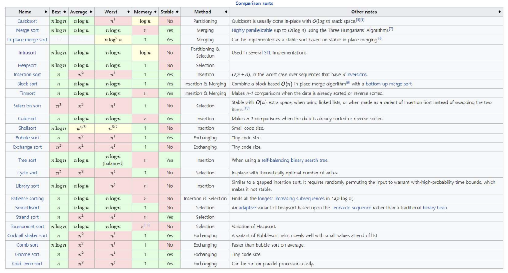

# Algorithm

### Contents

- [**Sorting**](#sorting)
- [**BFS, DFS**](#bfs-dfs)
- [**DP**](#dynamic-programming)

## Sorting



## BFS, DFS

> [BJ SILVER]
> [늑대와 양](./BJ%20Silver/s3_16956.py),
> [바이러스](./BJ%20Silver/s3_2606.py),
> [유기농 배추](./BJ%20Silver/s2_1012.py),
> [DFS와 BFS](./BJ%20Silver/s2_1260.py),
> [효율적인 해킹](./BJ%20Silver/s1_1325.py),
> [Best Grass](./BJ%20Silver/s5_6186.py),
> [The Game of Death](./BJ%20Silver/s4_11558.py),
>
> [SWEA D4]
> [정사각형 방](./SWEA%20D4/d4_1861.py),

## Dynamic Programming

> [BJ Silver]
> [1로 만들기](./BJ%20Silver/s3_1462.py),

부분 문제 반복(Overlapping subproblems)과 최적 부분 구조(Optimal substructure)에서 시간 최적화

```python
# e.g. 피보나치 수열
## 기존의 재귀 함수 방식은, 동일한 함수가 반복적으로 호출됨
## 반복적인 부분을 저장하는 방법으로 실행 속도를 높일 수 있음
def fibonacci(num):
    if num == 1:
        return 1
    if num == 0:
        return 0
    return fibonacci(num-1) + fibonacci(num-2)
```

### Dynamic Programming (Bottom-Up)

최초 값부터 차례대로 계산해 나가는 방식<br>
가장 작은 index부터 목표하는 값으로 향하는 것

- 어떤 입력이 들어와도 처음부터 계산하기 때문에, 불필요한 연산이 생김

```python
def fibonacci_dp(num):
    f = [0, 1]
    for i in range(2, num+1):
        f.append(f[i-1] + f[i-2])
    return f
```

### Memoization (Top-Down)

이전 계산값을 메모리에 저장하여(=캐싱), 매번 다시 실행하지 않도록 하는 방식<br>
맨 위의 값에서 재귀로 가장 작은 index를 향하는 것

- 동일 계산 반복 시 주로 사용
- 메모리 공간을 약간 더 사용하지만, 실행 속도가 빨라짐
- recursion error 주의

```python
def fibonacci_memoi(num):
    global memo
    if num >= 2 and len(memo) <= num:
        memo.append(fibonacci_memoi(num-1) + fibonacci_memoi(num-2))
    return memo[num]
memo = [0, 1]
```
