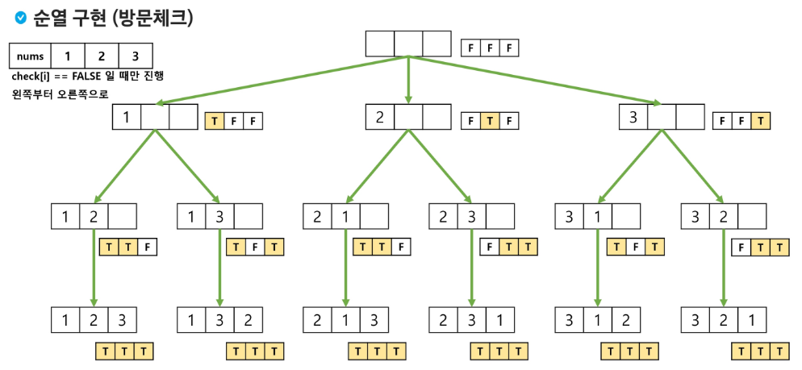

# Backtracking
가능한 모든 경우를 탐색하는 중 해답으로 이어지지 않은 경우에 대해서는 탐색하지 않도 되돌아가며 해결하는 알고리즘 기법  
- 유망(promising) : 현재 상태(노드, 경로)가 문제의 해답으로 발전할 가능성이 높은지를 판단하는 기준
- 가지치기(pruning) : 탐색 중 불필요한 경로를 제거하여 탐색의 효율성을 높이는 방법
- 일반적으로 경우의 수가 줄어들지만, 최악의 경우에는 여전히 지수함수 시간을 요하므로 해결이 불가능
    - e.g. 가지치기가 거의 이루어지지 않은 상황, 문제가 매우 큰 입력을 가지는 상황, 유효한 해답이 거의 없는 상황

### N Queen 문제
모든 경우의 수를 탐색하면, 해답이 될 가능성이 전혀 없는 수들도 검색해야 하므로 비효율적 -> 해당 노드의 유망성을 판단하고 백트래킹을 적용
``` java
NQueen(node v)
    IF promising(v)
        IF there is a solution at v
            write the solution
        ELSE
            For each child u of v
                NQeen(u)
```

### Permutation (순열)
서로 다른 원소들을 특정한 순서로 나열하는 것
- 서로 다른 n개의 원소를 가지는 집합에서 r개를 뽑아 순서 있게 나열하는 경우  
    `nPr = n x (n - 1) x (n - 2) x ... x (n - r + 1)`
- n > 12인 경우, 시간 복잡도 폭발적으로 증가  

| N | 순열의 수 | Million/sec | Billion/sec | Trillion/sec |
|:-:|---------:|:-----------:|:-----------:|:------------:|
|10 |                3,628,800||||
|11 |               39,916,800|seconds|||
|12 |              479,001,600|minutes|||
|13 |            6,227,020,800|hours|seconds||
|14 |           87,178,291,200|day|minute||
|15 |        1,207,674,368,000|weeks|minutes||
|16 |       20,922,789,888,000|months|hours|seconds|
|17 |      355,687,428,096,000|years|days|minutes|
|18 |    6,402,373,705,728,000||months|hours|
|19 |  121,645,100,408,832,000||years|days|
|20 |2,432,902,008,176,640,000|||month|  

#### 반복문
3개의 원소를 가진 배열이 있을 때, 모든 순열을 생성해 보시오.  
e.g. arr = {1, 2, 3}  
```java
FOR i1 in arr
    FOR i2 in arr
        IF i1 != i2
            FOR i3 in arr
                IF i1 != i3 AND i2 != i3
                    print(i1, i2, i3)
```

#### swap
```java
/* Definition
 * - arr[] : 데이터가 저장된 배열
 * - swap(i, j) : arr[i]와 arr[j] 교환
 */
perm(n, k)
    /* Args
    * - n : 원소의 개수
    * - k : 현재까지 교환된 원소의 개수
    */
    IF k == n
        print arr  // 원하는 작업 수행
    ELSE
        FOR i in k -> n - 1
            swap(k, i);
            perm(n, k + 1);
            swap(k, i);
```

#### 방문 체크
```java
/* Definition
 * - nums : 데이터
 * - result : 결과 저장 배열
 * - check : 해당 원소를 사용했는지 체크하기 위한 배열
 */
perm(index)
    if index == N
        return  // 순열 생성 완료
    for i from 0 to N - 1
        if check[i]
            continue
        result[index] = nums[i]
        check[i] = true
        perm(index + 1)
        check[i] = false
```  


#### Bit Masking
```java
/* Definition
 * - nums : 데이터
 * - sel : 결과 저장 배열
 */
perm(index, visited)
    /* Args
    * - index : 결과 저장할 인덱스
    * - visited : 해당 원소 사용했는지 체크
    */
    if index == N
        return  // 순열 생성 완료
    for i from 0 to N - 1
        if visited & (1 << i) != 0
            continue
        sel[index] = nums[i]
        perm(index + 1, visited | 1 << i)
```